# IQGS RAG Service

Internal microservice cho **IQGS** (Intelligent Question Generation System) — ingest tài liệu từ Azure Blob, chunk/embed vào **PostgreSQL pgvector**, retrieve theo scope **SYSTEM / HR**, sinh interview plan và câu hỏi phỏng vấn JSON.

**Tech stack:** Python 3.11+ · FastAPI 2.0 · Ollama · PostgreSQL pgvector

> Service này **không** expose API cho Frontend. Chỉ IQGS Backend (.NET) gọi qua header `X-Internal-Api-Key`.

---

## Mục lục

1. [Giới thiệu](#1-giới-thiệu)
2. [Vai trò trong hệ thống](#2-vai-trò-trong-hệ-thống)
3. [Kiến trúc tổng quan](#3-kiến-trúc-tổng-quan)
4. [Cấu trúc thư mục](#4-cấu-trúc-thư-mục)
5. [Cơ sở dữ liệu](#5-cơ-sở-dữ-liệu)
6. [API Reference](#6-api-reference)
7. [Luồng xử lý](#7-luồng-xử-lý)
   - [7.1 Ingest đồng bộ](#71-ingest-đồng-bộ)
   - [7.2 Ingest async + callback](#72-ingest-async--callback)
   - [7.3 Retrieval pipeline](#73-retrieval-pipeline)
   - [7.4 Sinh interview plan](#74-sinh-interview-plan)
   - [7.5 Sinh câu hỏi từ approved plan](#75-sinh-câu-hỏi-từ-approved-plan)
   - [7.6 Shortcut sinh câu hỏi (dev)](#76-shortcut-sinh-câu-hỏi-dev)
   - [7.7 Validate & Parse JD](#77-validate--parse-jd)
   - [7.7a Parse CV (SCRUM-300)](#77a-parse-cv-scrum-300)
   - [7.8 Question Assist (Ask AI)](#78-question-assist-ask-ai)
   - [7.9 Xóa document chunks](#79-xóa-document-chunks)
   - [7.10 Luồng end-to-end HR](#710-luồng-end-to-end-hr)
8. [Tích hợp Backend .NET](#8-tích-hợp-backend-net)
9. [Cấu hình](#9-cấu-hình)
10. [Cài đặt & chạy service](#10-cài-đặt--chạy-service)
11. [Ví dụ API](#11-ví-dụ-api)
12. [Xử lý lỗi](#12-xử-lý-lỗi)
13. [Test & Troubleshooting](#13-test--troubleshooting)
14. [Đã loại bỏ (v2)](#14-đã-loại-bỏ-v2)
15. [Tài liệu liên quan](#15-tài-liệu-liên-quan)

---

## 1. Giới thiệu

IQGS RAG Service là microservice Python chuyên xử lý pipeline **Retrieval-Augmented Generation** cho module tuyển dụng:

| Chức năng | Mô tả |
|-----------|--------|
| **Knowledge ingest** | Tải file PDF/DOCX/TXT từ Azure Blob → chunk → embed → lưu `knowledge_chunks` |
| **Vector retrieval** | Tìm kiếm cosine similarity theo scope SYSTEM (toàn hệ thống) và HR (theo owner) |
| **Interview plan** | Retrieve context + LLM sinh kế hoạch phỏng vấn JSON |
| **Question generation** | Retrieve context + LLM sinh câu hỏi theo approved plan |
| **JD parse/validate** | Trích xuất và kiểm tra Job Description từ file hoặc text |
| **Question Assist** | Ask AI per-question — HR chat để chỉnh sửa/gợi ý từng câu hỏi |

**Nguyên tắc thiết kế:**

- **Stateless:** RAG không lưu plan, không quản lý trạng thái HR approve. Backend chịu trách nhiệm persist và orchestration.
- **Internal-only:** Mọi endpoint nghiệp vụ nằm dưới `/internal/rag/*`, bảo vệ bằng shared secret.
- **Async production:** Luồng production dùng endpoint `/async` (HTTP 202) + callback PATCH về Backend để tránh timeout 120s.

---

## 2. Vai trò trong hệ thống

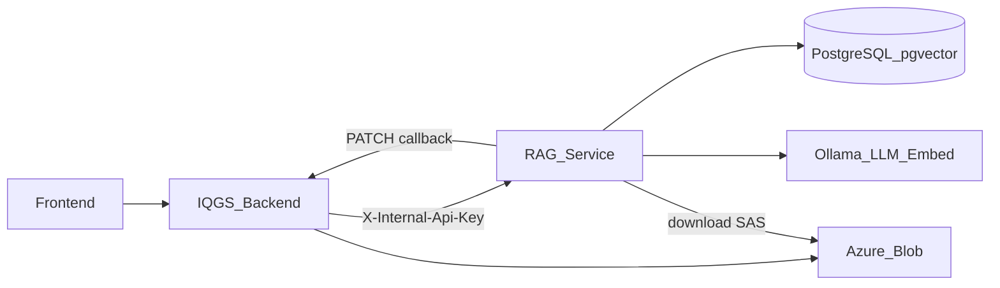

| Thành phần | Vai trò |
|------------|---------|
| **Frontend** | HR Portal / Admin — upload tài liệu, JD, review plan, Ask AI |
| **IQGS Backend** | Orchestration: Blob storage, DB metadata, Hangfire jobs, gọi RAG |
| **RAG Service** | Pipeline AI: parse, chunk, embed, retrieve, LLM generation |
| **PostgreSQL** | Bảng `knowledge_chunks` (pgvector) — dùng chung DB với Backend |
| **Azure Blob** | Lưu file gốc; RAG tải qua SAS URL khi ingest |
| **Ollama** | LLM (`gemma4b:cloud`) + embedding (`nomic-embed-text`, 768 dims) |

Backend **không** chứa logic embed/search/LLM — chỉ HTTP client (`RagService.cs`) và callback endpoints.

---

## 3. Kiến trúc tổng quan

### 3.1 Component diagram (nội bộ RAG)

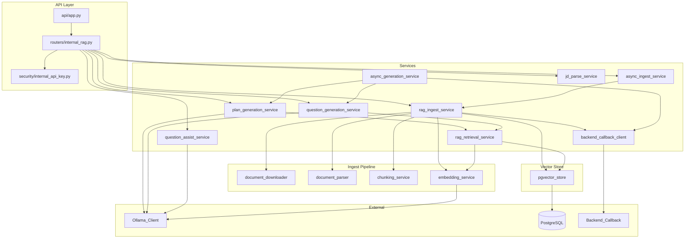

### 3.2 Phân tầng trách nhiệm

| Layer | File chính | Trách nhiệm |
|-------|-----------|-------------|
| **API** | `api/app.py`, `routers/internal_rag.py` | Routing, auth, exception handling |
| **Services** | `services/*.py` | Business logic từng use case |
| **Vector Store** | `vectorstores/pgvector_store.py` | CRUD chunks, similarity search |
| **Models** | `models/internal_schemas.py` | Pydantic request/response schemas |
| **Config** | `config/settings.py` | Đọc biến môi trường `.env` |
| **Security** | `security/internal_api_key.py` | Verify `X-Internal-Api-Key` |

Sơ đồ Draw.io chi tiết hơn: [`docs/diagrams/iqgs-rag-architecture.drawio`](../docs/diagrams/iqgs-rag-architecture.drawio)

---

## 4. Cấu trúc thư mục

```
RAG/
├── api/
│   ├── app.py                  # FastAPI entry point, /health
│   ├── deps.py                 # DI singleton: services, vector store, Ollama client
│   └── exception_handlers.py   # Structured error response
├── routers/
│   └── internal_rag.py         # Tất cả /internal/rag/* endpoints
├── config/
│   └── settings.py             # Pydantic BaseSettings từ .env
├── security/
│   └── internal_api_key.py     # Header auth dependency
├── vectorstores/
│   ├── base.py                 # Abstract vector store interface
│   └── pgvector_store.py       # PostgreSQL pgvector implementation
├── services/
│   ├── rag_ingest_service.py       # Sync ingest orchestrator
│   ├── async_ingest_service.py     # Background ingest wrapper
│   ├── rag_retrieval_service.py    # Embed query + dual-scope search
│   ├── plan_generation_service.py  # Retrieve → LLM → plan JSON
│   ├── question_generation_service.py  # Retrieve → LLM → questions JSON
│   ├── question_assist_service.py  # Ask AI per question (no retrieval)
│   ├── jd_parse_service.py         # Validate/parse JD file & text
│   ├── cv_parse_service.py         # Parse CV + AI trích skills (SCRUM-300)
│   ├── async_generation_service.py # Background plan/questions + callback
│   ├── backend_callback_client.py  # PATCH status/generation-result về BE
│   ├── embedding_service.py        # Ollama batch embedding
│   ├── chunking_service.py         # Wrapper text chunker
│   ├── document_parser.py          # PDF/DOCX/TXT parser
│   ├── document_downloader.py        # Download blob qua SAS URL
│   ├── json_output_parser.py       # Parse LLM JSON output
│   ├── rag_context_helpers.py      # Format context [HỆ THỐNG]/[HR], citations
│   └── rag_error_helpers.py        # Structured error payload builder
├── models/
│   └── internal_schemas.py     # Pydantic DTOs (request/response)
├── helpers/
│   ├── text_chunker.py         # Recursive character split
│   ├── jd_validator.py         # JD length/word validation rules
│   └── experience_level_infer.py  # Infer seniority từ JD text
├── exceptions/
│   └── ingest_errors.py        # Custom ingest exceptions
├── scripts/
│   ├── init_knowledge_chunks.sql   # Dev DDL cho bảng knowledge_chunks
│   ├── check_db.py                 # Kiểm tra kết nối DB + extension vector
│   ├── diagnose_retrieval.py       # Debug similarity search
│   ├── stress_sync_plan.py         # Stress test sync plan endpoint
│   └── test_similarity_sql.py      # Test raw SQL cosine distance
├── tests/                      # pytest unit/integration tests
├── data_RAG/                   # Sample dev data (KHÔNG dùng production ingest)
├── requirements.txt
├── .env.example
├── run-local.ps1               # Chạy local: kiểm tra Ollama + uvicorn
├── start-all.ps1               # Ollama + RAG + Cloudflare tunnel
└── README.md
```

---

## 5. Cơ sở dữ liệu

RAG **chỉ** đọc/ghi/xóa bảng `knowledge_chunks`. Backend quản lý `knowledge_documents` (metadata + Blob URL).

### 5.1 Schema `knowledge_chunks`

```sql
CREATE TABLE knowledge_chunks (
    id          UUID PRIMARY KEY,
    document_id UUID NOT NULL,
    owner_id    UUID NULL,           -- NULL khi scope = SYSTEM
    scope       VARCHAR(20) NOT NULL,  -- 'SYSTEM' | 'HR'
    chunk_index INT NOT NULL,
    content     TEXT NOT NULL,
    metadata    JSONB,
    embedding   vector(768) NOT NULL,
    created_at  TIMESTAMPTZ NOT NULL DEFAULT NOW()
);
```

**Indexes:**

| Index | Mục đích |
|-------|----------|
| `ix_knowledge_chunks_document_id` | Xóa/re-ingest theo document |
| `ix_knowledge_chunks_scope_owner` | Filter retrieval theo scope + owner |
| `ix_knowledge_chunks_embedding_hnsw` | HNSW cosine similarity search |

DDL dev: [`scripts/init_knowledge_chunks.sql`](scripts/init_knowledge_chunks.sql)  
Production: migration EF Core từ IQGS Backend — `vector(768)` **phải khớp** `EMBEDDING_DIMENSION`.

### 5.2 Scope rules

| Scope | `owner_id` khi insert | Retrieve |
|-------|----------------------|----------|
| `SYSTEM` | `NULL` | Top-K toàn hệ thống (`TOP_K_SYSTEM`) |
| `HR` | HR user Guid | Top-K chỉ của `ownerId` (`TOP_K_HR`) |

Khi sinh plan/câu hỏi, retrieval chạy **hai lần** (SYSTEM + HR) rồi merge context với nhãn `[HỆ THỐNG]` / `[HR]`.

### 5.3 Similarity search

SQL dùng cosine distance operator `<=>`:

```sql
ORDER BY embedding <=> query_vector
-- score = 1 - distance
```

---

## 6. API Reference

### 6.1 Authentication

Tất cả `/internal/rag/*` yêu cầu header:

```http
X-Internal-Api-Key: <INTERNAL_API_KEY>
```

`GET /health` **không** cần API key.

### 6.2 Bảng endpoints đầy đủ

| Method | Path | Mode | HTTP | Mô tả |
|--------|------|------|------|--------|
| `GET` | `/health` | — | 200 | Probe config + `SELECT 1` (không gọi LLM) |
| `POST` | `/internal/rag/ingest` | Sync | 200 | Ingest blob → parse → chunk → embed → pgvector |
| `POST` | `/internal/rag/ingest/async` | Async | **202** | Production ingest — trả ngay, xử lý background |
| `POST` | `/internal/rag/validate-jd` | Sync | 200 / **422** | Validate JD text (độ dài, số từ) |
| `POST` | `/internal/rag/parse-jd` | Sync | 200 / **422** | Multipart upload file → trích JD text |
| `POST` | `/internal/rag/parse-cv` | Sync | 200 / **422** / **502** | Multipart CV (PDF/DOCX/JPG/PNG) → AI trích `skills[]` + `summary` |
| `POST` | `/internal/rag/generate-plan` | Sync | 200 | Retrieve + LLM → interview plan JSON |
| `POST` | `/internal/rag/generate-plan/async` | Async | **202** | Production plan generation |
| `POST` | `/internal/rag/generate-questions-from-plan` | Sync | 200 | Retrieve + LLM → questions theo approved plan |
| `POST` | `/internal/rag/generate-questions-from-plan/async` | Async | **202** | Production question generation |
| `POST` | `/internal/rag/generate-questions` | Sync | 200 | **Dev shortcut:** JD → questions (bỏ plan) |
| `POST` | `/internal/rag/question-assist` | Sync | 200 | Ask AI per question (không vector search) |
| `POST` | `/internal/rag/evaluate-question-set` | Sync | 200 | Đánh giá bộ câu hỏi vs JD — verdict lời, không điểm số |
| `DELETE` | `/internal/rag/documents/{documentId}` | Sync | 200 / **500** | Xóa tất cả chunks theo document |

### 6.3 Response models chính

| Endpoint | Response model | Fields quan trọng |
|----------|---------------|-------------------|
| `/ingest` | `IngestResponse` | `documentId`, `status`, `chunkCount` |
| `/ingest/async` | `AsyncAcceptedResponse` | `accepted`, `documentId`, `phase: "INGEST"` |
| `/generate-plan/async` | `AsyncAcceptedResponse` | `accepted`, `jobId`, `phase: "PLAN"` |
| `/generate-questions-from-plan/async` | `AsyncAcceptedResponse` | `accepted`, `jobId`, `phase: "QUESTIONS"` |
| `/parse-jd` | `ParseJdResponse` | `success`, `jobDescription`, `fileName`, `stats` |
| `/parse-cv` | `ParseCvResponse` | `success`, `skills`, `summary`, `fileName` |
| `/generate-plan` | `GeneratePlanResponse` | `success`, `plan`, `processingTimeMs`, `error` |
| `/generate-questions-from-plan` | `GenerateQuestionsFromPlanResponse` | `success`, `questions`, `processingTimeMs`, `error` |
| `/question-assist` | `QuestionAssistResponse` | `success`, `assistantMessage`, `suggestion` |
| `/evaluate-question-set` | `EvaluateQuestionSetResponse` | `success`, `verdict`, `summaryVi`/`summaryEn`, `questionFlags` |
| `/health` | `HealthResponse` | `status`, `database`, `configValid` |

### 6.4 Callback endpoints (RAG → Backend)

RAG **gọi ra** Backend (không phải endpoint của RAG):

| Method | Backend path | Khi nào |
|--------|-------------|---------|
| `PATCH` | `/internal/knowledge-documents/{id}/status` | Ingest: `PROCESSING` → `COMPLETED` / `FAILED` |
| `PATCH` | `/internal/question-generation-jobs/{jobId}/generation-result` | Async plan/questions hoàn thành |

---

## 7. Luồng xử lý

### 7.1 Ingest đồng bộ

Dùng cho **dev/test local**. Backend production dùng async (mục 7.2).

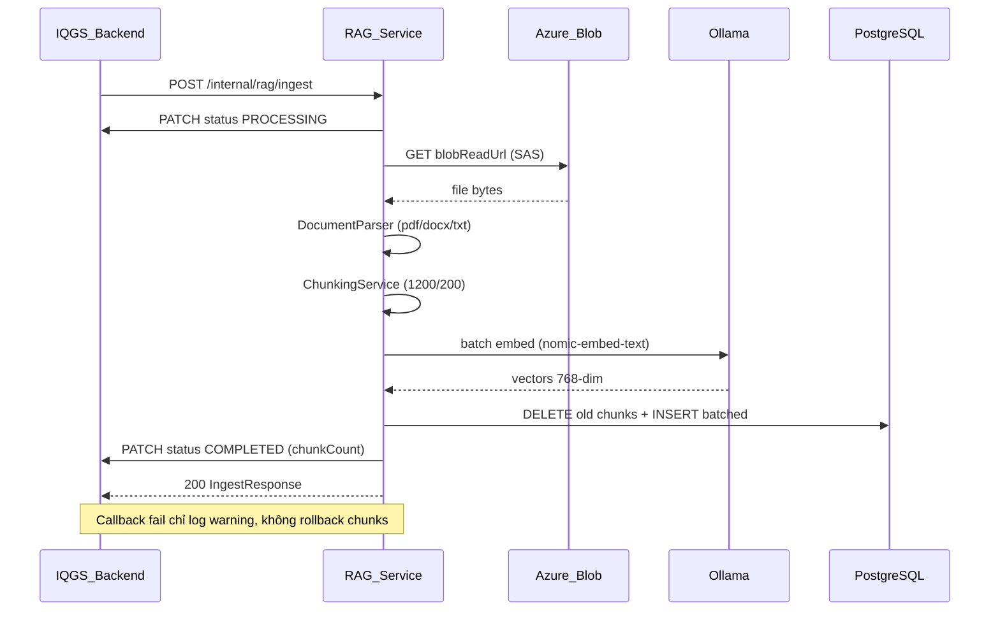

**Các bước chi tiết:**

1. Validate `scope` + `ownerId` (HR bắt buộc có owner)
2. Callback `PROCESSING` về Backend
3. `DocumentDownloader` tải file qua SAS URL (timeout `REQUEST_TIMEOUT_SECONDS`)
4. `DocumentParser` trích text từ PDF/DOCX/TXT
5. `ChunkingService` chia recursive (size/overlap từ config)
6. `EmbeddingService` embed batch qua Ollama OpenAI-compatible API
7. `PgVectorStore.upsert_chunks_batched` — xóa chunks cũ của `document_id`, insert mới
8. Callback `COMPLETED` (+ `chunkCount`) hoặc `FAILED` (+ `errorMessage`)

---

### 7.2 Ingest async + callback

**Production flow** (IQGS-81). Hangfire gọi async để tránh timeout khi file lớn.

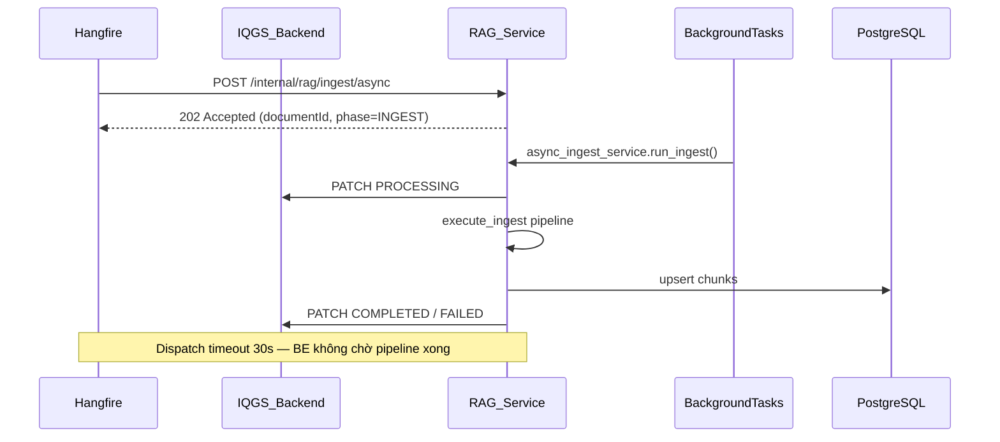

**Lý do async:** File sách lớn (PDF nhiều trang) có thể vượt 120s. Backend nhận 202 ngay, callback là source of truth cho trạng thái cuối.

---

### 7.3 Retrieval pipeline

Dùng chung cho `generate-plan` và `generate-questions-from-plan`.

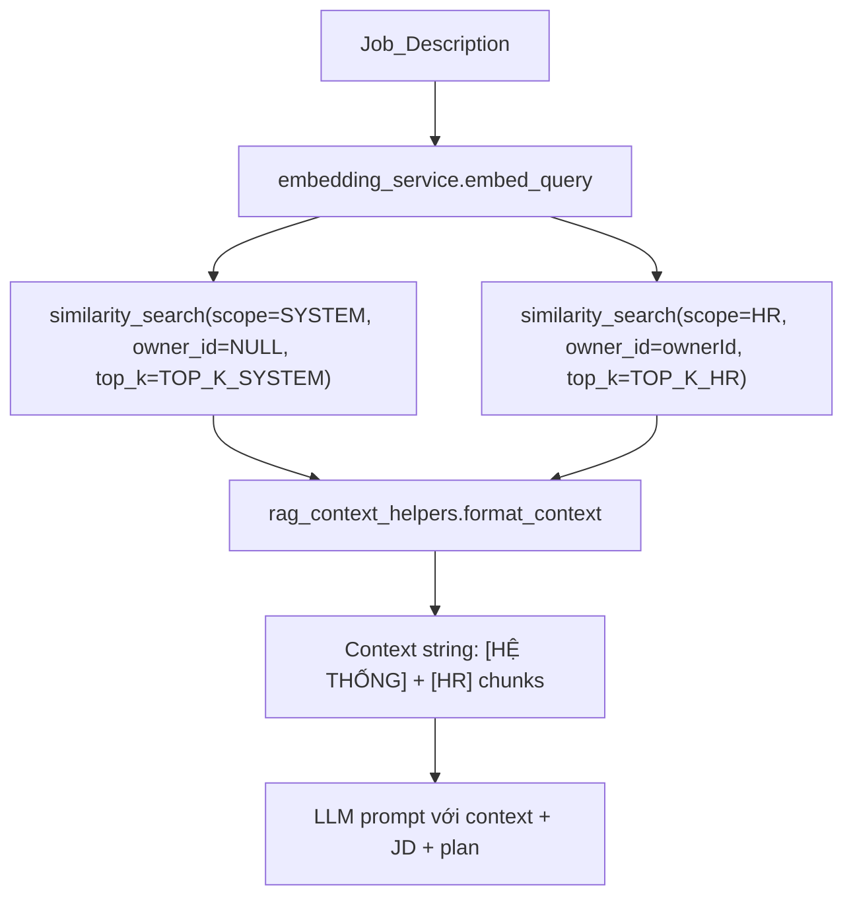

**Chi tiết:**

- Query vector: embed toàn bộ `jobDescription`
- Hai search độc lập theo scope — HR chỉ thấy tài liệu của mình + tài liệu SYSTEM
- Context format: mỗi chunk có metadata (`sourceTitle`, `section`, `year`, …)
- Citations trong output questions map về chunk đã retrieve

---

### 7.4 Sinh interview plan

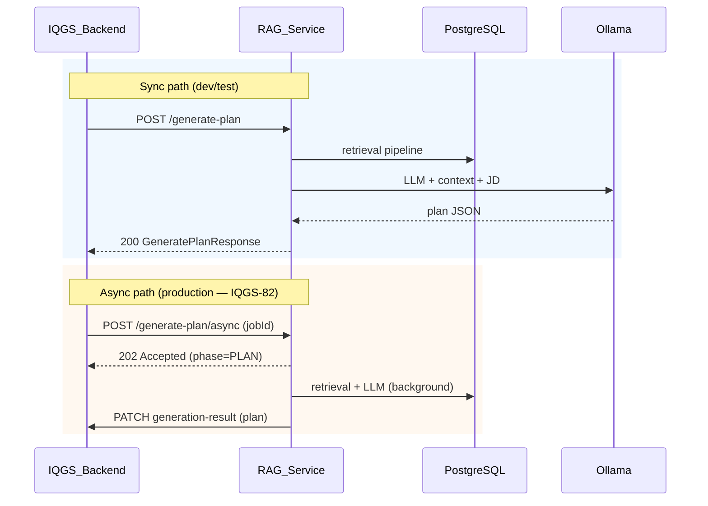

**Input chính:** `ownerId`, `jobDescription`, `numberOfQuestions`, `difficulty`, `questionTypes`, `skills`

**Output plan:** `roleTitle`, `summary`, `totalQuestions`, `questionTypeDistribution`, `recommendedQuestionOutline`, `skills`, `difficulty`

RAG **stateless** — Backend lưu plan vào DB, HR review/edit/approve trên Backend.

---

### 7.5 Sinh câu hỏi từ approved plan

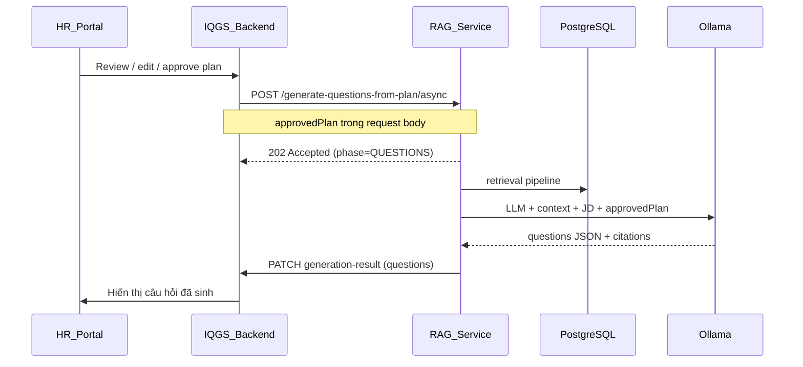

**Quan trọng:** `approvedPlan` là plan đã qua HR chỉnh sửa — RAG không biết plan draft hay approved, chỉ nhận object trong request.

Mỗi question output gồm: `question`, `questionType`, `difficulty`, `skill`, `rationale`, `sampleAnswer`, `citations[]`.

---

### 7.6 Shortcut sinh câu hỏi (dev)

Bỏ qua bước plan — sinh câu hỏi trực tiếp từ JD:

```
POST /internal/rag/generate-questions
  → retrieval pipeline
  → LLM trực tiếp (không có approvedPlan)
  → questions JSON
```

Chỉ dùng khi dev/test nhanh. Production luôn qua plan → approve → questions.

---

### 7.7 Validate & Parse JD

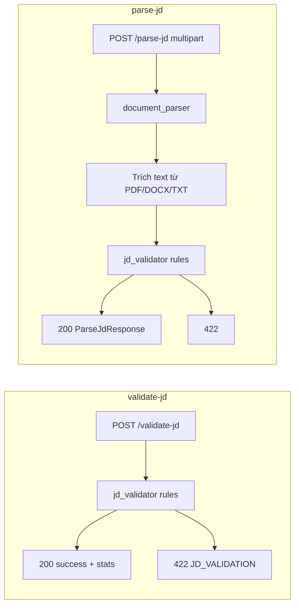

**Validation rules** (configurable qua `.env`):

| Rule | Biến môi trường | Mặc định |
|------|----------------|----------|
| Min characters | `JD_MIN_CHARS` | 400 |
| Max characters | `JD_MAX_CHARS` | 30,000 |
| Min words | `JD_MIN_WORDS` | 100 |
| Max words | `JD_MAX_WORDS` | 5,000 |

Backend gọi `parse-jd` khi HR upload file JD (`QuestionGenerationJobService.ParseJdAsync`).

---

### 7.7a Parse CV (SCRUM-300)

Candidate upload CV qua Backend → RAG trích kỹ năng bằng **một model** `CHAT_MODEL` (Hướng A).

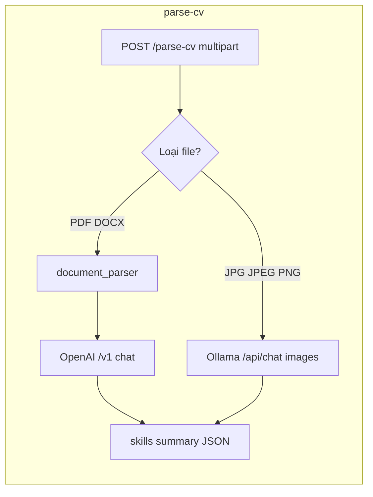

| Loại file | Cách xử lý |
|-----------|------------|
| `.pdf`, `.docx` | `DocumentParser` trích text → `chat.completions` qua `/v1` |
| `.jpg`, `.jpeg`, `.png` | Base64 → Ollama native `POST /api/chat` với field `images` |

**Lưu ý:** Ảnh **không** gửi qua OpenAI-style `image_url` trên `/v1` — dùng native API để model Gemma đọc được ảnh.

Backend gọi `parse-cv` khi Candidate upload CV (`RagService.ParseCvAsync` → `CandidateCvService`).

---

### 7.8 Question Assist (Ask AI)

**Không dùng vector search** — chỉ LLM với context đã có trong request.

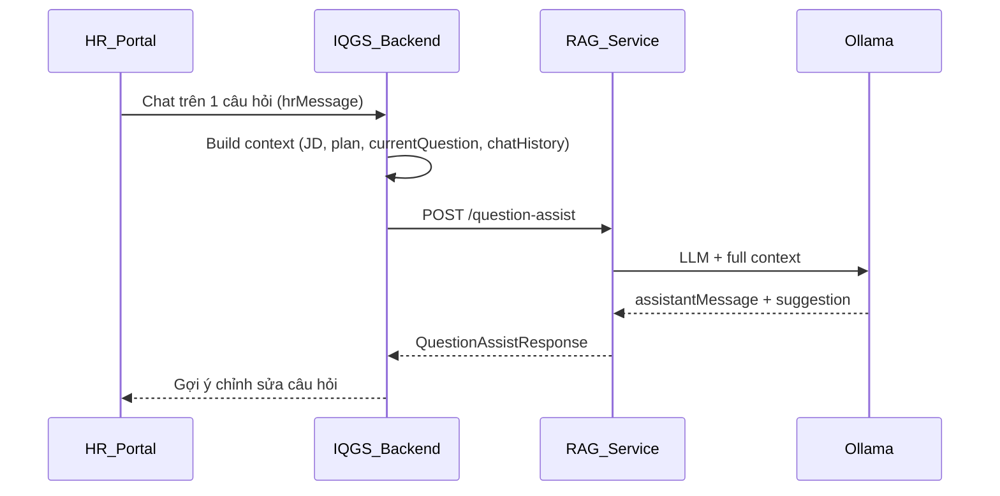

**Context gửi kèm:** `jobDescription`, `plan`, `currentQuestion`, `skills`, `difficulty`, `chatHistory`, `isManuallyEdited`

**Suggestion output:** `question`, `rationale`, `sampleAnswer`, `difficulty`, `questionType`

Ticket: SCRUM-215 — Ask AI per question.

---

### 7.9 Xóa document chunks

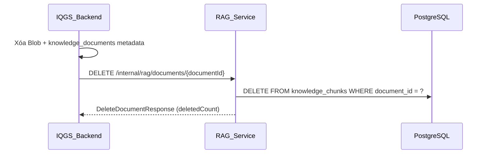

Nếu `documentId` không tồn tại → `deletedCount: 0`, vẫn trả `success: true`.

---

### 7.10 Luồng end-to-end HR

Toàn bộ hành trình HR từ upload knowledge đến sinh câu hỏi:

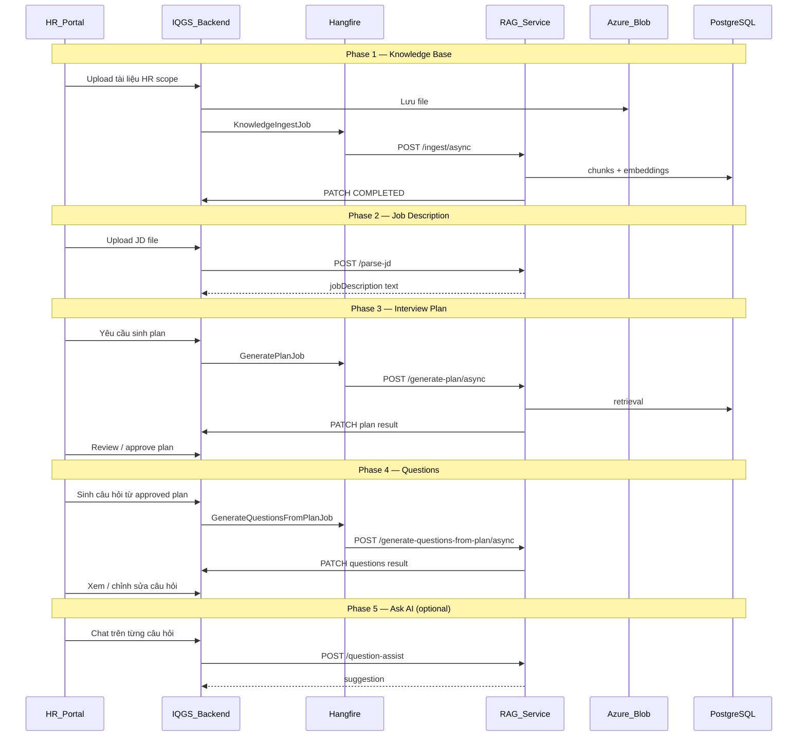

---

## 8. Tích hợp Backend .NET

### 8.1 Map Backend → RAG endpoint

| Backend component | File | RAG endpoint |
|-------------------|------|-------------|
| `KnowledgeIngestJob` | `InfrastructureLayer/Jobs/KnowledgeIngestJob.cs` | `POST /ingest/async` |
| `GeneratePlanJob` | `InfrastructureLayer/Jobs/GeneratePlanJob.cs` | `POST /generate-plan/async` |
| `GenerateQuestionsFromPlanJob` | `InfrastructureLayer/Jobs/GenerateQuestionsFromPlanJob.cs` | `POST /generate-questions-from-plan/async` |
| `QuestionGenerationJobService` | `ApplicationLayer/Services/...` | `POST /parse-jd` |
| `CandidateCvService` | `ApplicationLayer/Services/CandidateCvService.cs` | `POST /parse-cv` |
| `QuestionAiAssistService` | `ApplicationLayer/Services/...` | `POST /question-assist` |
| `QuestionSetJdFitService` | `ApplicationLayer/Services/QuestionSetJdFitService.cs` | `POST /evaluate-question-set` |
| `KnowledgeDocumentService` | delete flow | `DELETE /documents/{id}` |
| `RagService` (HttpClient) | `InfrastructureLayer/External/RagService.cs` | Tất cả endpoints trên |
| `AdminRagStatusController` | `WebAPI/Controllers/Admin/...` | Proxy `GET /health` |

### 8.2 Callback endpoints (Backend nhận)

| Controller | Path | Payload |
|------------|------|---------|
| `KnowledgeDocumentsInternalController` | `PATCH /internal/knowledge-documents/{id}/status` | `status`, `chunkCount`, `errorMessage` |
| `QuestionGenerationJobsInternalController` | `PATCH /internal/question-generation-jobs/{jobId}/generation-result` | `phase`, `success`, `plan`/`questions`, `error` |

### 8.3 Status enums

**Knowledge document ingest:**

```
QUEUED → PROCESSING → COMPLETED | FAILED
```

**Question generation job:**

```
PENDING → GENERATING_PLAN → PLAN_READY → GENERATING_QUESTIONS → COMPLETED | FAILED
```

Watchdog job (`StuckKnowledgeDocumentWatchdogJob`) xử lý document kẹt `PROCESSING` quá lâu (IQGS-84).

### 8.4 Backend config (`appsettings.json`)

```json
"RagService": {
  "BaseUrl": "https://iqgsrag.cloud",
  "TimeoutSeconds": 120,
  "DispatchTimeoutSeconds": 30,
  "HealthCheckTimeoutSeconds": 5,
  "EmbeddingDimension": 768
}
```

- `DispatchTimeoutSeconds`: timeout khi gọi endpoint `/async` (chỉ chờ 202)
- `TimeoutSeconds`: timeout cho sync endpoints

---

## 9. Cấu hình

Sao chép `.env.example` → `.env` và chỉnh các giá trị:

| Biến | Bắt buộc | Mặc định | Mô tả |
|------|----------|----------|--------|
| `DATABASE_URL` | Có | — | PostgreSQL connection string (dùng chung Backend) |
| `BACKEND_INTERNAL_BASE_URL` | Có | — | URL Backend cho callback PATCH |
| `INTERNAL_API_KEY` | Có | — | Shared secret — **phải trùng** Backend |
| `OLLAMA_BASE_URL` | | `http://localhost:11434/v1` | Ollama OpenAI-compatible API |
| `CHAT_MODEL` | | `gemma4b:cloud` | Model LLM cho plan/questions/assist |
| `EMBEDDING_MODEL` | | `nomic-embed-text` | Model embedding (768 dims) |
| `EMBEDDING_DIMENSION` | Có | `768` | Phải khớp migration Backend `vector(N)` |
| `EMBEDDING_BATCH_SIZE` | | `64` | Số chunk embed mỗi batch |
| `CHUNK_SIZE` | | `1200` | Kích thước chunk (ký tự) |
| `CHUNK_OVERLAP` | | `200` | Overlap giữa các chunk |
| `TOP_K_SYSTEM` | | `5` | Số chunk SYSTEM retrieve |
| `TOP_K_HR` | | `5` | Số chunk HR retrieve |
| `REQUEST_TIMEOUT_SECONDS` | | `120` | Timeout blob download + callback |
| `JD_MIN_CHARS` | | `400` | JD tối thiểu (ký tự) |
| `JD_MAX_CHARS` | | `30000` | JD tối đa (ký tự) |
| `JD_MIN_WORDS` | | `100` | JD tối thiểu (từ) |
| `JD_MAX_WORDS` | | `5000` | JD tối đa (từ) |
| `DEBUG` | | `false` | `true` = trả `rawAnswer` trong generate-questions |

Settings class: [`config/settings.py`](config/settings.py)

---

## 10. Cài đặt & chạy service

### 10.1 Cài đặt dependencies

```bash
cd RAG
python -m venv .venv
.venv\Scripts\activate          # Windows
# source .venv/bin/activate     # Linux/macOS
pip install -r requirements.txt
copy .env.example .env          # chỉnh DATABASE_URL, INTERNAL_API_KEY, ...
```

### 10.2 PostgreSQL + pgvector

Dev DDL:

```bash
psql $DATABASE_URL -f scripts/init_knowledge_chunks.sql
```

Production: dùng migration EF Core từ IQGS Backend.

Kiểm tra kết nối:

```bash
python scripts/check_db.py
```

### 10.3 Ollama

```bash
ollama pull nomic-embed-text
ollama pull gemma4b:cloud
```

### 10.4 Chạy service

**Cách 1 — PowerShell script (khuyến nghị local):**

```powershell
.\run-local.ps1
```

Script kiểm tra Ollama đang chạy, sau đó start uvicorn tại `http://localhost:8000`.

**Cách 2 — Manual:**

```bash
python -m uvicorn api.app:app --host 0.0.0.0 --port 8000 --reload
```

**Cách 3 — Full stack + tunnel (deploy dev):**

```powershell
.\start-all.ps1
```

Khởi động Ollama + RAG API + Cloudflare tunnel (`iqgsrag.cloud`).

**Health check:**

```bash
curl http://localhost:8000/health
```

---

## 11. Ví dụ API

### 11.1 Ingest (sync)

```http
POST /internal/rag/ingest
X-Internal-Api-Key: internal-secret
Content-Type: application/json

{
  "documentId": "3fa85f64-5717-4562-b3fc-2c963f66afa6",
  "scope": "SYSTEM",
  "ownerId": null,
  "blobReadUrl": "https://...sas...",
  "fileName": "rubric.pdf",
  "sourceTitle": "SWE Interview Rubric",
  "sourceUrl": "https://example.com/rubric",
  "section": "Technical",
  "year": 2024
}
```

Response `200`:

```json
{
  "documentId": "3fa85f64-5717-4562-b3fc-2c963f66afa6",
  "status": "COMPLETED",
  "chunkCount": 42
}
```

### 11.2 Ingest (async — production)

```http
POST /internal/rag/ingest/async
X-Internal-Api-Key: internal-secret
Content-Type: application/json

{ "...same body as sync ingest..." }
```

Response `202`:

```json
{
  "accepted": true,
  "documentId": "3fa85f64-5717-4562-b3fc-2c963f66afa6",
  "phase": "INGEST"
}
```

### 11.3 Validate JD

```http
POST /internal/rag/validate-jd
X-Internal-Api-Key: internal-secret
Content-Type: application/json

{
  "jobDescription": "We are looking for a Senior Backend Developer...",
  "fileName": "jd_backend.md"
}
```

Response `200`:

```json
{
  "success": true,
  "jobDescription": "We are looking for...",
  "warnings": [],
  "stats": { "charCount": 1520, "wordCount": 245 }
}
```

### 11.4 Parse JD (multipart)

```http
POST /internal/rag/parse-jd
X-Internal-Api-Key: internal-secret
Content-Type: multipart/form-data

file: <jd_backend_senior.pdf>
```

Response `200`:

```json
{
  "success": true,
  "jobDescription": "Senior Backend Developer...",
  "fileName": "jd_backend_senior.pdf",
  "warnings": [],
  "stats": { "charCount": 2100, "wordCount": 350 }
}
```

### 11.4a Parse CV (multipart) — SCRUM-300

```http
POST /internal/rag/parse-cv
X-Internal-Api-Key: internal-secret
Content-Type: multipart/form-data

file: <cv_backend_dev.pdf>
```

Định dạng hỗ trợ: `.pdf`, `.docx`, `.jpg`, `.jpeg`, `.png`.

Response `200`:

```json
{
  "success": true,
  "skills": ["C#", "ASP.NET Core", "PostgreSQL", "Docker"],
  "summary": "Backend Developer với 3 năm kinh nghiệm xây dựng REST API.",
  "fileName": "cv_backend_dev.pdf"
}
```

Lỗi định dạng/đọc file: `422` (`stage: CV_PARSE`). Lỗi AI/LLM: `502` (`stage: CV_AI_ANALYSIS`).

### 11.5 Generate plan (sync)

```http
POST /internal/rag/generate-plan
X-Internal-Api-Key: internal-secret
Content-Type: application/json

{
  "ownerId": "hr-user-guid",
  "jobDescription": "...",
  "numberOfQuestions": 10,
  "difficulty": "medium",
  "questionTypes": ["technical", "behavioral", "system-design", "problem-solving"],
  "skills": ["C#", "ASP.NET Core", "PostgreSQL"]
}
```

Response `200`:

```json
{
  "success": true,
  "plan": {
    "roleTitle": "Backend Developer",
    "summary": "...",
    "totalQuestions": 10,
    "difficulty": "medium",
    "skills": ["C#", "ASP.NET Core"],
    "questionTypeDistribution": [
      { "type": "technical", "count": 6, "reason": "..." }
    ],
    "recommendedQuestionOutline": [
      {
        "order": 1,
        "type": "technical",
        "difficulty": "medium",
        "skill": "ASP.NET Core",
        "focusArea": "Middleware",
        "goal": "..."
      }
    ]
  },
  "processingTimeMs": 8500
}
```

### 11.6 Generate plan (async — production)

```http
POST /internal/rag/generate-plan/async
X-Internal-Api-Key: internal-secret
Content-Type: application/json

{
  "jobId": "job-guid-here",
  "ownerId": "hr-user-guid",
  "jobDescription": "...",
  "numberOfQuestions": 10,
  "difficulty": "medium",
  "questionTypes": ["technical", "behavioral"],
  "skills": ["C#", "ASP.NET Core"]
}
```

Response `202`:

```json
{
  "accepted": true,
  "jobId": "job-guid-here",
  "phase": "PLAN"
}
```

### 11.7 Generate questions from approved plan

```http
POST /internal/rag/generate-questions-from-plan
X-Internal-Api-Key: internal-secret
Content-Type: application/json

{
  "ownerId": "hr-user-guid",
  "jobDescription": "...",
  "approvedPlan": {
    "roleTitle": "Backend Developer",
    "summary": "...",
    "difficulty": "medium",
    "totalQuestions": 10,
    "skills": ["C#", "ASP.NET Core"],
    "questionTypeDistribution": [
      { "type": "technical", "count": 6, "reason": "..." }
    ],
    "recommendedQuestionOutline": [
      {
        "order": 1,
        "type": "technical",
        "difficulty": "medium",
        "skill": "ASP.NET Core",
        "focusArea": "Middleware",
        "goal": "..."
      }
    ],
    "notes": "HR edited/approved plan."
  }
}
```

Response `200`:

```json
{
  "success": true,
  "questions": [
    {
      "order": 1,
      "question": "How does ASP.NET Core middleware pipeline work?",
      "questionType": "technical",
      "difficulty": "medium",
      "skill": "ASP.NET Core",
      "rationale": "...",
      "sampleAnswer": "...",
      "citations": [{ "sourceTitle": "SWE Rubric", "excerpt": "..." }]
    }
  ],
  "processingTimeMs": 12000
}
```

### 11.8 Generate questions (shortcut / dev)

```http
POST /internal/rag/generate-questions
X-Internal-Api-Key: internal-secret
Content-Type: application/json

{
  "ownerId": "hr-user-guid",
  "jobDescription": "...",
  "numberOfQuestions": 10,
  "difficulty": "Medium",
  "questionTypes": ["Technical", "Behavioral"],
  "skills": ["C#", "ASP.NET Core", "PostgreSQL"]
}
```

### 11.9 Question Assist (Ask AI)

```http
POST /internal/rag/question-assist
X-Internal-Api-Key: internal-secret
Content-Type: application/json

{
  "ownerId": "hr-user-guid",
  "hrMessage": "Làm câu hỏi này khó hơn và thêm phần system design",
  "context": {
    "jobDescription": "Senior Backend Developer...",
    "plan": { "roleTitle": "Backend Developer", "totalQuestions": 10 },
    "difficulty": "hard",
    "skills": ["C#", "System Design"],
    "currentQuestion": {
      "order": 3,
      "question": "Explain dependency injection in ASP.NET Core",
      "questionType": "technical",
      "difficulty": "medium"
    },
    "isManuallyEdited": false
  },
  "chatHistory": [
    { "role": "user", "content": "Câu hỏi này có phù hợp với senior không?" },
    { "role": "assistant", "content": "Câu hỏi hiện tại ở mức mid-level..." }
  ]
}
```

Response `200`:

```json
{
  "success": true,
  "assistantMessage": "Đây là phiên bản nâng cao hơn...",
  "suggestion": {
    "question": "Design a microservice architecture using ASP.NET Core with DI...",
    "rationale": "Kết hợp DI knowledge với system design cho senior level",
    "sampleAnswer": "...",
    "difficulty": "hard",
    "questionType": "system-design"
  }
}
```

### 11.10 Delete document chunks

```http
DELETE /internal/rag/documents/3fa85f64-5717-4562-b3fc-2c963f66afa6
X-Internal-Api-Key: internal-secret
```

Response `200`:

```json
{
  "success": true,
  "documentId": "3fa85f64-5717-4562-b3fc-2c963f66afa6",
  "deletedCount": 42,
  "message": "Đã xóa 42 chunk(s) thành công."
}
```

---

## 12. Xử lý lỗi

### 12.1 Structured error format

Lỗi trả về qua `build_rag_error_detail` (`services/rag_error_helpers.py`):

```json
{
  "error": "JD không hợp lệ",
  "detail": "Job description quá ngắn (150 ký tự, tối thiểu 400)",
  "stage": "JD_VALIDATION",
  "exceptionType": "JdValidationError",
  "errors": ["Job description quá ngắn (150 ký tự, tối thiểu 400)"]
}
```

Backend deserialize qua `RagErrorResponse` DTO.

### 12.2 Error stages phổ biến

| Stage | Khi nào | HTTP |
|-------|---------|------|
| `JD_VALIDATION` | JD không đủ dài/ngắn | 422 |
| `JD_PARSE` | Không parse được file JD | 422 |
| `INGEST` | Lỗi download/parse/embed | 500 (sync) / callback FAILED (async) |
| `RETRIEVAL` | Lỗi embed query hoặc DB search | 500 |
| `LLM_GENERATION` | LLM timeout hoặc JSON parse fail | 500 / callback FAILED |
| `CHUNK_DELETE` | Lỗi xóa chunks | 500 |

### 12.3 Callback errors

Callback về Backend **không raise exception** — chỉ log warning nếu PATCH thất bại. Chunks đã ghi vào DB sẽ không bị rollback.

### 12.4 Async job failures

Khi async job fail, RAG gọi:

```
PATCH /internal/question-generation-jobs/{jobId}/generation-result
{ "success": false, "phase": "PLAN"|"QUESTIONS", "error": "..." }
```

HR có thể retry qua Backend: `POST .../retry-plan` hoặc `POST .../retry-questions`.

---

## 13. Test & Troubleshooting

### 13.1 Chạy tests

```bash
pip install pytest
pytest tests/ -q
```

Tests theo module:

| File test | Coverage |
|-----------|----------|
| `test_async_ingest.py` | Async ingest + callback |
| `test_async_generation.py` | Async plan/questions + callback |
| `test_internal_api.py` | API routing + auth |
| `test_plan_generation.py` | Plan generation service |
| `test_generate_from_plan.py` | Questions from plan |
| `test_question_assist_service.py` | Ask AI |
| `test_parse_jd.py` | JD parse/validate |
| `test_pgvector_store.py` | Vector store operations |

Backend tests liên quan:

```bash
dotnet test IQGS-SEP490-Backend/ApplicationLayer.Tests
```

### 13.2 Scripts debug

| Script | Mục đích |
|--------|----------|
| `scripts/check_db.py` | Kiểm tra kết nối PostgreSQL + extension `vector` |
| `scripts/diagnose_retrieval.py` | Debug similarity search với JD mẫu |
| `scripts/test_similarity_sql.py` | Test raw SQL cosine distance |
| `scripts/stress_sync_plan.py` | Stress test endpoint sync plan |

### 13.3 Checklist troubleshooting

| Triệu chứng | Nguyên nhân có thể | Cách xử lý |
|-------------|-------------------|------------|
| `health` trả `database: false` | PostgreSQL chưa chạy hoặc `DATABASE_URL` sai | Kiểm tra `scripts/check_db.py` |
| Embedding dimension mismatch | `EMBEDDING_DIMENSION` ≠ migration `vector(N)` | Đồng bộ config RAG + Backend migration |
| Ollama connection refused | Ollama chưa chạy | `ollama serve` hoặc mở Ollama app |
| Model not found | Chưa pull model | `ollama pull nomic-embed-text` + `gemma4b:cloud` |
| Ingest callback không về BE | `BACKEND_INTERNAL_BASE_URL` sai hoặc API key lệch | Kiểm tra `.env` + Backend `INTERNAL_API_KEY` |
| Retrieval trả 0 chunks | Chưa ingest tài liệu hoặc scope/owner sai | Chạy `diagnose_retrieval.py` |
| Async job kẹt PROCESSING | RAG crash giữa chừng | Watchdog job (IQGS-84) hoặc retry manual |
| JD validation 422 | Text quá ngắn/dài | Kiểm tra `JD_MIN_CHARS` … `JD_MAX_WORDS` |

---

## 14. Đã loại bỏ (v2)

Các thành phần **không còn** trong phiên bản hiện tại:

| Đã xóa | Lý do |
|--------|-------|
| `/api/v1/*` endpoints | ChromaDB, multipart upload, chat session |
| ChromaDB vector store | Chuyển sang PostgreSQL pgvector |
| CLI `main.py` | Thay bằng FastAPI service |
| Session-based interview plans | Backend quản lý plan state |
| RAG lưu plan vào DB | Stateless — Backend persist |
| RAG quản lý HR approval | Backend orchestration |
| Chatbot Q&A tổng quát | Chỉ còn question-assist per-question |

`data_RAG/` vẫn có thể tồn tại trong repo như **sample tài liệu dev** — không dùng trong production ingest path.

Prototype C# RAG chatbot (`RagChatbotDemo/`) là project độc lập, không liên quan service production này.

---

## 15. Tài liệu liên quan

| Tài liệu | Jira | Nội dung |
|----------|------|----------|
| [`docs/features/async-knowledge-ingest.md`](../docs/features/async-knowledge-ingest.md) | IQGS-81 | Async ingest + callback |
| [`docs/features/rag-async-callback-question-generation.md`](../docs/features/rag-async-callback-question-generation.md) | IQGS-82 | Async plan/questions + callback |
| [`docs/features/rag-async-watchdog.md`](../docs/features/rag-async-watchdog.md) | IQGS-84 | Watchdog document kẹt PROCESSING |
| [`docs/features/ask-ai-per-question.md`](../docs/features/ask-ai-per-question.md) | SCRUM-215 | Ask AI per question |
| [`docs/features/jira-async-rag-platform-tickets.md`](../docs/features/jira-async-rag-platform-tickets.md) | IQGS-81..84 | Tổng hợp platform tickets |
| [`docs/diagrams/iqgs-rag-architecture.drawio`](../docs/diagrams/iqgs-rag-architecture.drawio) | — | Sơ đồ kiến trúc Draw.io |
| [`docs/review 2/diagrams/report4/package-rag.mmd`](../docs/review%202/diagrams/report4/package-rag.mmd) | — | Package diagram (review 2) |
| [`IQGS-SEP490-Backend/InfrastructureLayer/External/RagService.cs`](../IQGS-SEP490-Backend/InfrastructureLayer/External/RagService.cs) | — | Backend HTTP client implementation |
